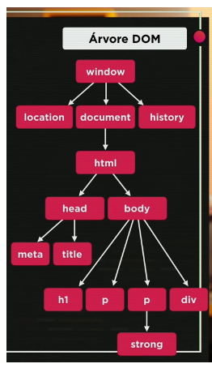

# Curso Javascript - Curso em Video

# Aula 1 - JavaScript / ECMAScript

O que o javascript faz? Praticamente tudo.
 * Mais voltado para o cliente (mas também roda em servidor)
 * A Netscape deciciu padronizar a linguegem javascript e então contratou uma empresa americana chamada ECMA que padronizou a linguagem e a batizou de ECMAscript.
#
# Aula 2 - Historia do Javascript
Em meados da década de 60 houve a guerra fria. Estados Unidos perdia feio... Em 1970 o presidente dos Estados Unidos decretu a criação de em centro para estudar melhorias tecnológiacas para a guerra: DARPA. O DARPA foi evoluindo e foi criado a ARPANET que concentrava todos os dados em uma redundância. Não demorou muito e outras pequenas 'redes' foram se juntando à ARPANET que em pouco tempo ficou gigantesca e se tornou a tão conhecida internet. 

Em 1993, em Genebra, criou as tecnologias WWW e o HTML.
Em 1995 foi criado a linguagem Moca. A Netscape, em uma jogada de markting, vendo que a linguagem Java estava famosa e na boca do povo, decidiu chamar a sua linguagem não mais de Moca mas sim de Javascript.

Em 1997, a Netscape deciciu padronizar a linguegem javascript e então contratou uma empresa americana chamada *ECMA* que padronizou a linguagem e a batizou de ECMAscript.

#
# Aula 3 - Iniciando...

Livros recomendados:
* Javascript - O guia definitivo
* Javascript - Guia do programador
* Ver referências no site da mozilla e da ECMA

Softwares necessários:
* Google Chrome
* Visual Studio Code (vscode)
* nodejs

#
# Aula 5 -  Variáveis, Tipos de dados e comentarios

Em javascript as variáveis são declaradas da seguinte maneira:

var nome = 'edilson'; ou
let nome = 'edilson'
Identificador é nome que se dá para uma variável: um identificador pode começar com uma letra, $ ou _
é possível usar letras ou números;
é possivel usar acentos ou símbolos;
Não podem conter espaços;
Não podem ser palavras reservadas;

## Tipos de dados

TIPOS DE DADOS (pode-se usar o typeof para saber o tipo de dados):

number; Infinity e NaN
string;
boolean;
null;
undefined;
object; Array
function;

## Comentarios

//Com essas barras nós comentamos uma linha no javascript

/*
este é para comentário em bloco
*/

#
# Aula 6 - Tratamento de Dados

Para declarar uma variavel usa-se:
var nome = 'Edilson'

PAra converter uma string em inteiro ou real use:
n = 1

Number.parseInt(n)
Number.parseFloat(n)

Na verso nova da linguagem eh possivel resolver de modo mais simples e enxuto: 

Number(n)

A funcao Number() ja identifica se o numero eh inteiro ou flutuante.

## Tratando Strings

No Javascript para concatenar uma string com uma variavel eh utilizado o + . Nas versoes mais novas foi adicionado o Template String que funciona da seguinte maneira:

nome = 'Edilson'

`Meu nome eh ${nome}`

Usamos a crase ao inves das aspas simples

O nome do ${} eh placeholder

IMPORTANTE: Para apenas strings utilize aspas duplas ou simples e para concatenar strings com alguma variavel utilize crases.

## Tratando numeros

Na seguinte situacao temos : n1 = 10.7

Para imprimir este valor com duas casas apos o ponto utlizamos a funcao toFixed. EX:

n1.toFixed(2)

Para adicionar o R$: 

```n1.toLocaleString('pt-BR', {style: 'currency', currency: 'BRL'})```

#
# Aula 7 - Operadores1

Usamos os seguintes operadores + - * / % **. Todos eles funcionam como nas outras linguagens:

OBS: Cuidado com a ordem de precedencia:

()

**

'* / % --> neste caso a ordem segue quem vier primeiro

## Operadores de incremento

Podemos simplificar o operador var x += 1 para x++
#
# Aula 8 - Operadores2

Operadores relacionais: < > >= <= == !=

Sempre retornam um boleano: True ou False

Ex: ``` 8 > 9 = false```

Operadores de Identidade:

Para o Javascript o 8 == '8' vai ser True... Resolvemos isso com o operador ===

Operadores Logicos: 

! Negacao

&& Conjuncao (e)

|| Disjuncao (ou)

Ha uma ordem de precedencia para os operadores: 

1 - Operadores Aritimeticos.

2 - Operadores Relacionais - Sempre da esquerda para a direita

3 - Operadores Logicos nesta ordem !, &&, ||

Operador Ternario: ?, :

O operador ternario tem tres partes : expressao ? true : false

ex: ```media >= 7 ? 'APROVADO' : 'REPROVADO'```


#
# Aula 9 - Introdução ao DOM

DOM é um acrônimo para Document Object Model (Modelo de Objetos para Documetnos). É um conjunto e objetos dentro do navegador que dará acesso aos componentes internos do Site que está sendo desenvolvido.

O DOM só está presente no javascript rodando no navegador. 

ÁRVORE DOM:

Tudo do DOm estará dentro do window. Dentro de window tem vários elementos que seguem uma ordem hierárquica. Veja um pequeno exemplo na imagem:



Existem vários métodos de acesso a esses elementos:  

* Por marca ```document.getElementsByTagName()```
* Por ID ```document.getElementById()```
* Por Nome ```document.getElementsByName()```
* Por Classe ```document.getElementsByClassName()```
* Por Seletor ```querySelector()``` | ```querySelectorAll()```

Vide ex005.html para exemplos.

#
# Aula 10 - Eventos DOM

Evento é tudo aquilo que possa acontecer com uma div, por exemplo um evento de mouse:

mouseenter, mousemove, mousedown, mouseup, click e mouseout.

Vide exercícios ex006 e ex007.

